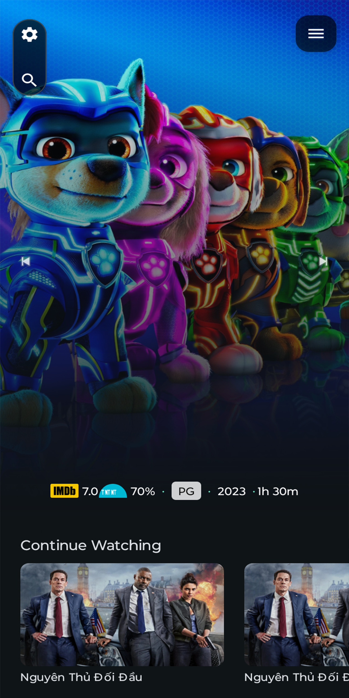
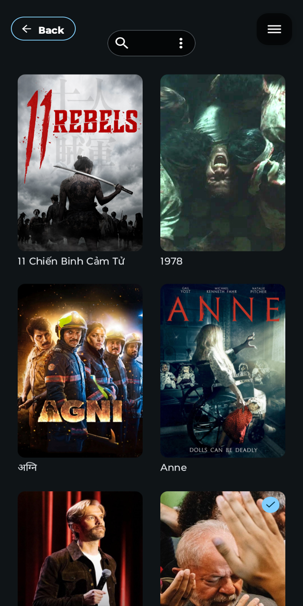
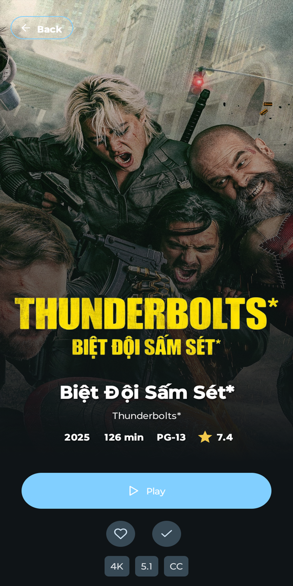
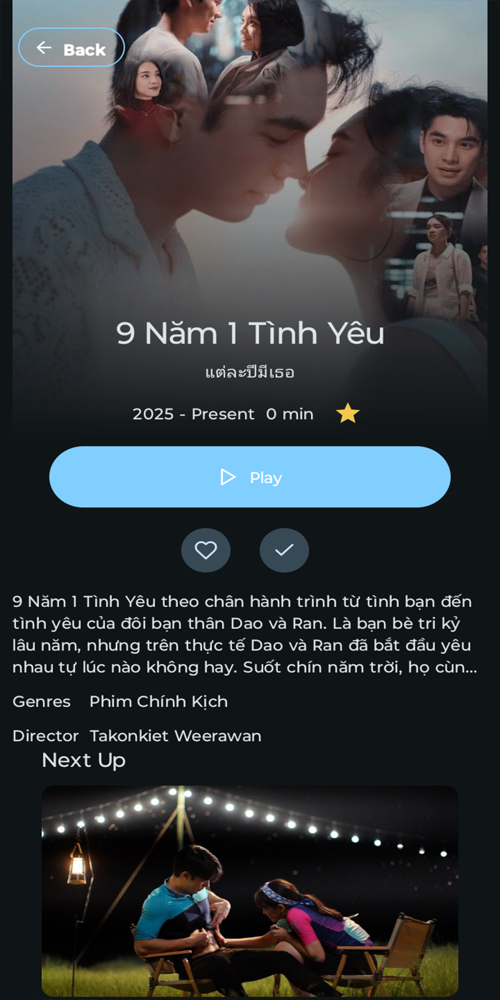
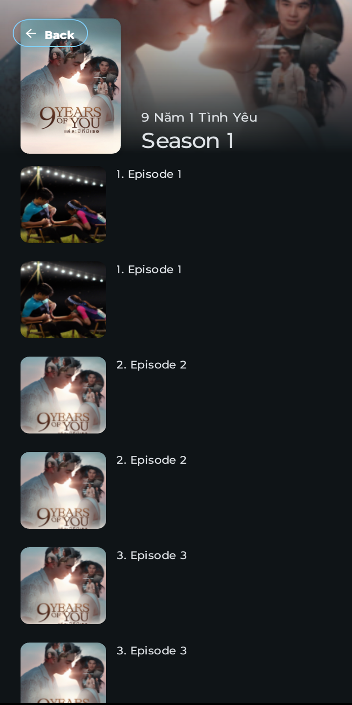

# Finslide

**Finslide is a Jellyfin client originating from the Findroid codebase but is now almost fully redesigned with new features and modern enhancements.**

**Project status:**
I am developing this application in my spare time, and since it is still in its early stages, expect some bugs.

## Screenshots
| Home                                | Library                             | Movie                           | Season                            | Episode                             |
|-------------------------------------|-------------------------------------|---------------------------------|-----------------------------------|-------------------------------------|
|  |  |  |  |  |

## Features
- Completely native interface
- Supported media items: movies, series, seasons, episodes 
  - Direct play only, (no transcoding)
- Offline playback / downloads
- ExoPlayer
  - Video codecs: H.263, H.264, H.265, VP8, VP9, AV1 
    - Support depends on Android device
  - Audio codecs: Vorbis, Opus, FLAC, ALAC, PCM, MP3, AAC, AC-3, E-AC-3, DTS, DTS-HD, TrueHD 
    - Support provided by ExoPlayer FFmpeg extension
  - Subtitle codecs: SRT, VTT, SSA/ASS, PGSSUB
    - SSA/ASS has limited styling support see [this issue](https://github.com/google/ExoPlayer/issues/8435)
- mpv
  - Container formats: mkv, mov, mp4, avi
  - Video codecs: H.264, H.265, H.266, VP8, VP9, AV1
  - Audio codecs: Opus, FLAC, MP3, AAC, AC-3, E-AC-3, TrueHD, DTS, DTS-HD
  - Subtitle codecs: SRT, VTT, SSA/ASS, DVDSUB
  - Optionally force software decoding when hardware decoding has issues.
- Picture-in-picture mode
- Media chapters
  - Timeline markers
  - Chapter navigation gestures

## Planned features
- Android TV
- Websocket connection (Syncplay)
- Chromecast support

## License
This project is licensed under [GPLv3](LICENSE).

Based on [Findroid](https://github.com/jarnedemeulemeester/findroid) by Jarne Demeulemeester, with extensive modifications and enhancements.  
This project uses the [Jellyfin](https://jellyfin.org) API and would not be possible without the Jellyfin project and community.

The logo is AI generated.  

The Android robot is reproduced or modified from work created and shared by Google and used according to terms described in the Creative Commons 3.0 Attribution License.

Android is a trademark of Google LLC.  
Google Play and the Google Play logo are trademarks of Google LLC.

